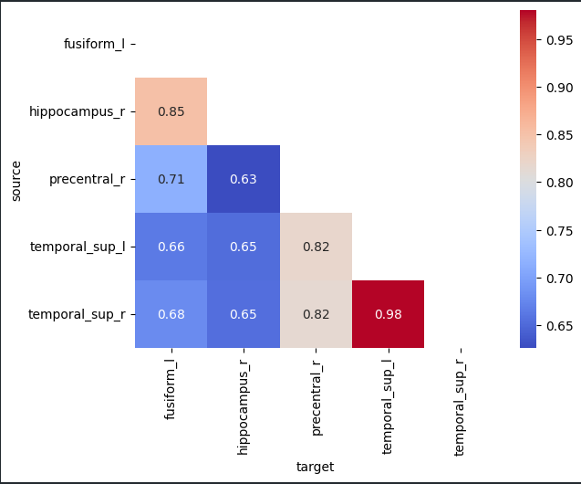
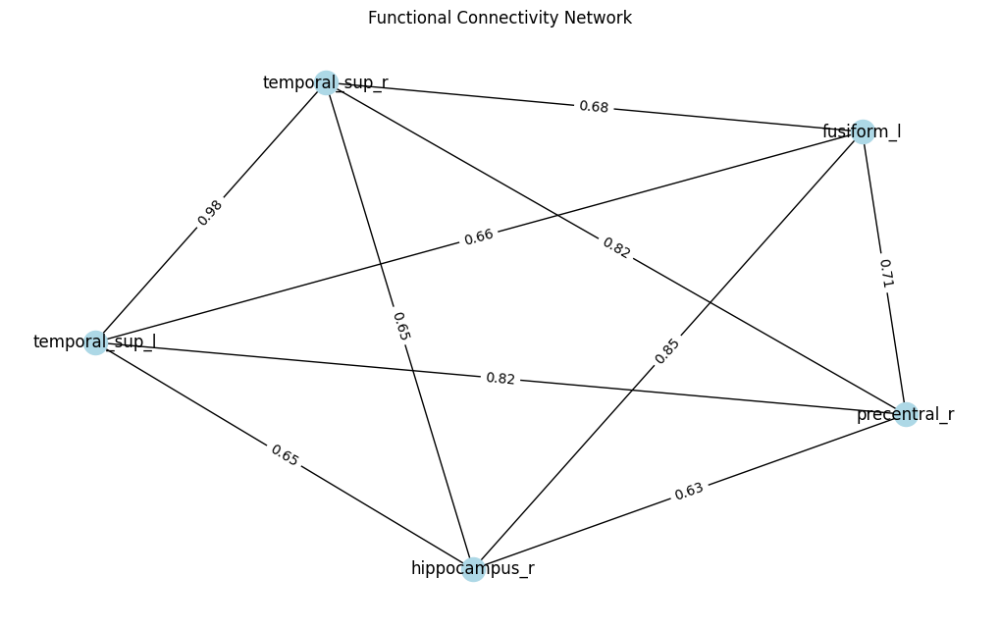

# f-MRI Symphony: Unveiling Auditory Networks
## Connectomics(AIL7150) Assignment

This assignment aims to provide hands-on experience in analyzing functional Magnetic Resonance Imaging (fMRI) data using advanced tools like SPM-12, AAL3, and MATLAB. By working with a real auditory task dataset, we have gain insights into the functional connectivity networks of the brain and their underlying dynamics.

# Objectives
- [X] Install and configure the necessary software tools (MATLAB, SPM-12, AAL3, and MarsBar) for fMRI data analysis.
- [X] Preprocess and analyze auditory fMRI data using SPM-12.
- [X] Explore brain regions and label activated clusters using the AAL3 atlas.
- [X] Extract time-series data from regions of interest (ROIs) using MarsBar.
- [X] Construct functional connectivity networks based on the extracted time-series data.
- [X] Perform graph theoretical analysis on the binary functional connectivity network.

# Assignment Tasks
- Set up the working environment by installing MATLAB, SPM-12, AAL3, and MarsBar.
- Download and preprocess the auditory fMRI dataset using SPM-12.
- Label activated clusters using the AAL3 atlas and visualize brain regions with MarsBar.
- Extract time-series data from ROIs and construct a functional connectivity network.
- Analyze the functional connectivity network using graph theoretical measures (clustering coefficient, transitivity, and characteristic path length).

# Results and Analysis 

- All the processed images can be found in dir **MoAEpilot**.
- To replicate results the job files in '.mat' format can be found in auditory/jobs.
- Matlab figures for each analysis steps are saved in auditory/jobs. 
- Model file saved as spm.mat can be found in auditory/classical/spm.mat. 
- Extracted ROI timeseries are also saved in auditory/classical directory. 
- Part3.ipynb contains the functional connectivity analysis of the extracted ROI's using Pearson Correlation coefficient. 

- part3_analysis.pdf contains the graph theoretical analysis and graph formed due to the same. 

## Final activated regions and 3d renders

# Contributors

- [Gaurav Sangwan](https://github.com/gauravsangwan)
- [Mukul Shingwani](https://github.com/Mukulshingwani)
